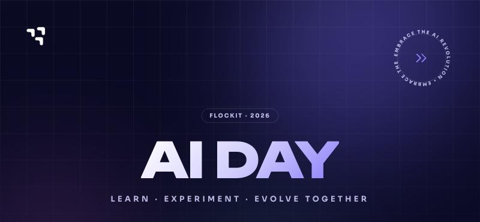

  

# Flock AI Day — Recursos

Lista curada de recursos sobre agentes de IA, armada para **AI Day**: la jornada interna de **Flockit** donde medimos y elevamos el nivel de adopción de IA del equipo. Es un repo público — cualquiera puede usarlo, y cualquiera puede sumar un recurso.

**🔗 [Plataforma del evento](https://ai-day-flockit.vercel.app)** — donde vive el Assessment, los niveles, el rubro de evaluación y el resto del programa (acceso con cuenta de Microsoft de Flockit).

## Qué es AI Day

AI Day es un evento interno de Flockit donde cada persona completa un Assessment que la ubica en uno de tres niveles de madurez de adopción de IA — **Explorer**, **Practitioner** o **Builder** — y después pasa la jornada trabajando en un desafío acorde a ese nivel. Qué se espera en cada nivel, y qué hace falta para subir al siguiente, vive en la [plataforma del evento](https://ai-day-flockit.vercel.app); este repo es el complemento de recursos para ir más a fondo en esos temas.

## Las capacitaciones del día

El día del evento se dan **dos charlas en vivo**, una por nivel. No quedan grabadas — si no pudiste estar en el momento, la forma de recuperar el contenido es por tu cuenta, con los recursos de este mismo repo.

| Nivel | Charla | Disertante |
|---|---|---|
| Explorer | De usar un chat a construir y desplegar | Federico Vázquez |
| Practitioner | Construyendo agentes: orquestadores, MCP y RAG | Francisco Sempé |
| Builder | Sin charla — se dedica la jornada a analizar y mejorar el propio repositorio | — |

Los perfiles **Builder** son el público principal de este repo: ya construyeron su primera solución agéntica o automatización, y acá tienen de dónde tirar para seguir subiendo el nivel durante la jornada (y después).

## Cómo está organizado

No es una colección de todo lo que existe sobre IA — es una selección enfocada en lo que más sirve para subir de nivel, siguiendo el mismo rubro que ya usa la plataforma de AI Day (orquestación, MCP, RAG, observabilidad, seguridad, costo, impacto de negocio).

| Carpeta | De qué se trata |
|---|---|
| [`orquestadores/`](./orquestadores) | Frameworks para coordinar varios agentes o pasos con estado: LangGraph, CrewAI, AutoGen, AWS Strands. |
| [`coordinacion-multiagente/`](./coordinacion-multiagente) | Patrones (supervisor, pipeline, paralelo, jerárquico, debate) para repartir trabajo entre varios agentes sin que termine siendo más lento o caro que uno solo. |
| [`sdks-de-agentes/`](./sdks-de-agentes) | SDKs de base para programar un agente propio: Claude Agent SDK, OpenAI Agents SDK, Google ADK, Vercel AI SDK, Pydantic AI. |
| [`harness/`](./harness) | Qué es un "harness" (la capa de control de un agente) y un ejemplo real open source para estudiarlo. |
| [`mcp/`](./mcp) | Model Context Protocol: el estándar para conectar agentes a herramientas y fuentes de datos. |
| [`rag/`](./rag) | Retrieval-Augmented Generation: chunking, reranking, vector DBs, RAG en producción. |
| [`observabilidad/`](./observabilidad) | Tracing y métricas de costo/latencia/calidad para sistemas con IA en producción. |
| [`evals/`](./evals) | Cómo medir la calidad de un agente de forma sistemática, con un dataset de casos, antes de shippear. |
| [`memoria-de-agentes/`](./memoria-de-agentes) | Arquitecturas de memoria de corto y largo plazo para que un agente no "olvide" entre sesiones. |
| [`seguridad-agentes/`](./seguridad-agentes) | Prompt injection, sandboxing, permisos y manejo de secretos al darle autonomía a un agente. |
| [`sdlc-con-ia/`](./sdlc-con-ia) | Un marco para encarar un proyecto con IA: intent → spec → plan, el SDLC AI-native de Anthropic, el AI-DLC de AWS y Spec-Driven Development. |
| [`papers/`](./papers) | Los papers detrás de los patrones que ya estás usando (ReAct, Toolformer, Reflexion, etc). |
| [`repos-de-referencia/`](./repos-de-referencia) | Proyectos open source reales para ver estos patrones aplicados, no solo en teoría. |
| [`cursos/`](./cursos) | Videos y charlas más largas para profundizar antes o después del evento. |

Conecta directo con la charla de Practitioner (Francisco Sempé), que introduce LangGraph, MCP, RAG y AWS Strands — este repo es donde profundizás cualquiera de esos temas si ya los conocés y querés ir más allá.

## Contribuir

Esto es una lista viva y pública: no hace falta ser de Flockit para sumar algo.

1. Fork o una rama nueva.
2. Sumá el recurso al README de la carpeta que corresponda — o abrí una carpeta nueva si el tema no encaja en ninguna de las que ya existen.
3. Alcanza con una línea de contexto: qué es, por qué vale la pena, y quién lo hizo (verificá que el link funcione antes de mandarlo).
4. Abrí un PR. Antes de mergear, confirmamos que el recurso sea real y relevante — nada de contenido copiado/scrapeado, solo links a la fuente original.

Si encontrás un link roto o algo que quedó desactualizado, también es bienvenido avisarlo por un issue o PR.
